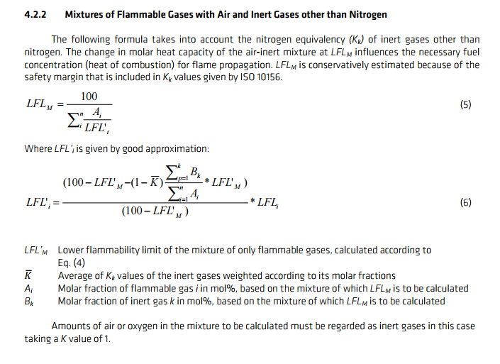
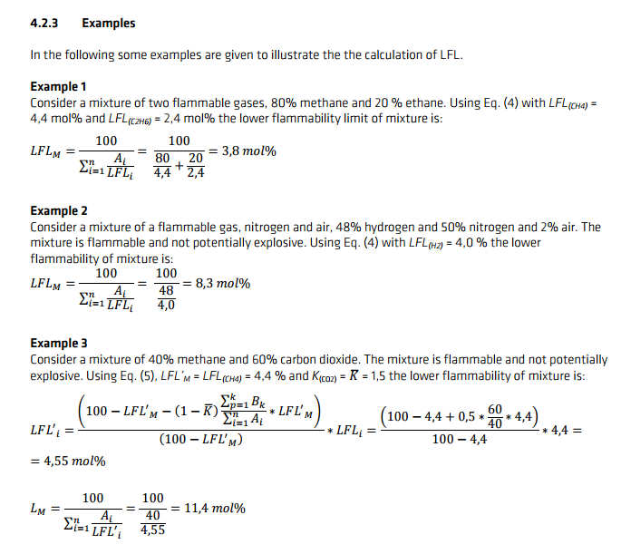

# LFL Calculation using Le Chatelier's Method

LFL (lower flammability limit) is the smallest percentage of flammable species in respect to air that can sustain a flame. The keyword is "in respect to air." The Le Chatelier's method essentially takes the molar avg of the flammable species' LFL to compute the mixture LFL. This method also takes into account of inert species and gives them a value in respect to Nitrogen. In other words, CO2 is a better inert agent than N2 so it gets a `K` value of 1.5.

The equation to compute LFL for a mixture can be seen below:

## Nitrogen Equivalency for Inert Gases

## LFL Calculation Examples

